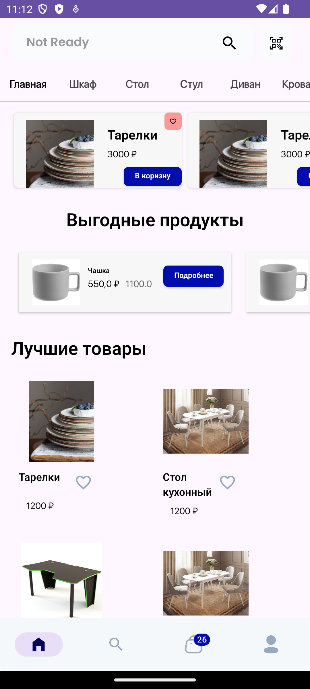
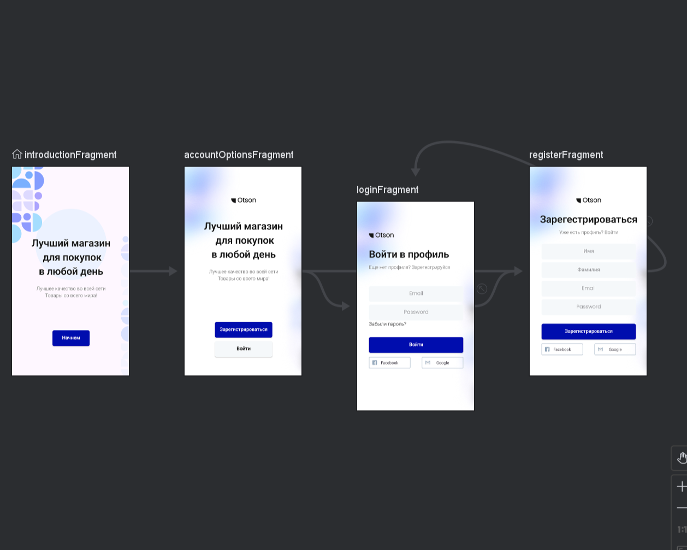

# Пример приложения по продаже вещей

  
   
  
  
  
   
  

  
   

## Приложение по продаже вещей

- Данные о продуктах хранятся в Cloud Firestore

- Описание и выбор цвета/размера для каждого продукта

- Возможность войти в профиль для заказа (email/pass) Firebase Authentication

- Просмотреть корзину

- Оформить заказ

- Сменить информацию о учетной записи

- И многое другое...

- Часть функционала не доведена до конца из времени

## Не реализовано 

- Вход через Google/Facebook

- Поиск

## Используемые технологии

- Navigation
- MVVM
- Coroutines
- Flow
- Dagger - Hilt
- Firebase
- Glide
- loading-button
  

